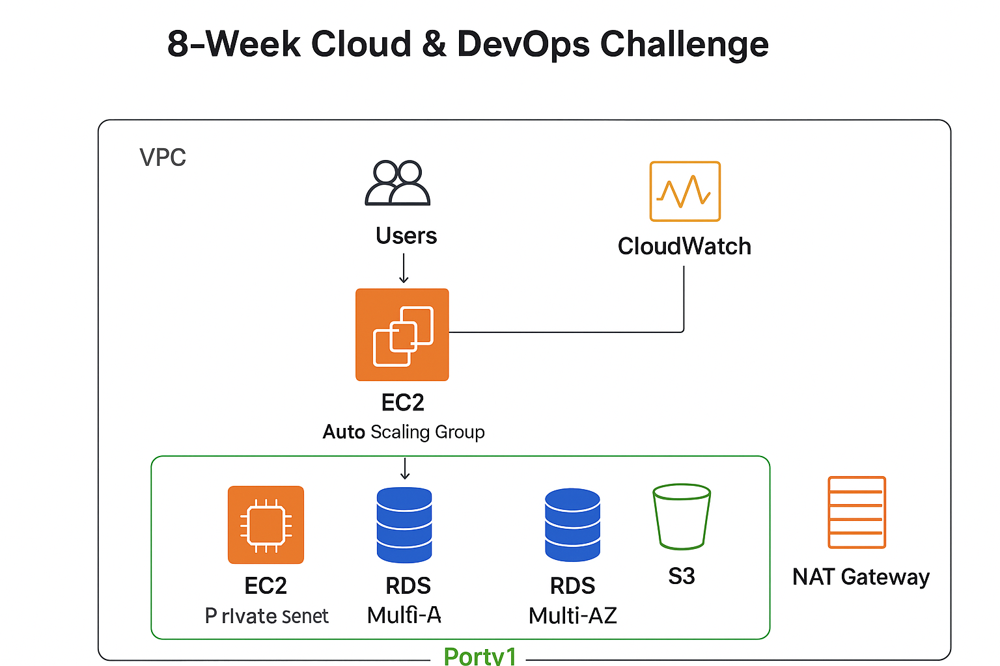

# 8-Week DevOps & Cloud Challenge – Terraform + AWS

## Overview
This is an 8-week structured DevOps and Cloud/Platform Engineer challenge designed to take you from foundational cloud skills to deploying **resilient, scalable infrastructure** using **Terraform and AWS**, with optional extensions into **Kubernetes and AI/ML**.

By the end of this challenge, you will have:  
- A multi-tier, modular AWS infrastructure  
- Hybrid compute modules (EC2 & Auto Scaling Groups)  
- Application Load Balancer (ALB) deployment  
- CloudWatch monitoring and alarms  
- Security best practices (IAM, security groups, encryption)  
- A portfolio-ready project with Terraform modules, outputs, and documentation  

## Daigram



---

## Structure

Week1/Week2/.../Week8/
│
├── main.tf # Root Terraform configuration
├── variables.tf # Root variables
├── outputs.tf # Root outputs
├── modules/ # Reusable Terraform modules
│ ├── vpc/
│ ├── compute-hybrid/
│ ├── alb/
│ ├── bastion_host/
│ ├── cloudwatch-alerts/
│ └── security/
├── envs/ # Environment-specific tfvars
│ ├── dev/
│ ├── stage/
│ └── prod/
├── scripts/ # User data or setup scripts
└── README.md

---

## Weekly Goals

**Week 1 – Cloud Foundations & Environment Setup**  
- Install Terraform & AWS CLI  
- Set up folder structure and state management  
- Deploy a simple VPC with public/private subnets  

**Week 2 – Networking & Security**  
- Multi-AZ VPC  
- NAT Gateways  
- Security Groups & IAM best practices  
- Modularize networking components  

**Week 3 – Compute & Bastion Host**  
- Launch EC2 instances  
- Set up Bastion host for SSH  
- Introduce outputs for inter-module communication  

**Week 4 – Application Load Balancer & Basic Monitoring**  
- Deploy ALB and attach EC2 instances  
- Configure basic CloudWatch alarms  
- Expand Terraform modules for ALB & monitoring  

**Week 5 – Hybrid Compute & Disaster Readiness**  
- Implement compute-hybrid module (EC2 ↔ ASG toggle)  
- Launch Templates for ASG  
- Basic disaster-readiness testing  
- Validate scaling policies via CloudWatch alarms  

**Week 6 – Advanced Monitoring & Observability**  
- CloudWatch Logs integration  
- Dashboards for CPU, memory, network, and ALB metrics  
- Optional Grafana dashboards  

**Week 7 – Security & IAM**  
- Least-privilege IAM roles  
- Network ACLs & Security Groups  
- Terraform state locking & secrets management  

**Week 8 – Final Project & Portfolio Integration**  
- Combine all modules into production-ready stack  
- Document architecture, modules, and outputs  
- Push to GitHub with README, visuals, and resume-ready bullets  

---

## Optional Extensions
- Kubernetes (EKS or k3s/kind)  
- CI/CD pipelines with GitHub Actions / CodePipeline  
- AI/ML deployment on AWS SageMaker + Lambda + API Gateway  

---

## How to Use

1. Clone the repository:  
```bash
git clone <repo-url>
cd Week1
Initialize Terraform:
terraform init
Plan & apply environment:
terraform plan -var-file=envs/dev/dev.tfvars
terraform apply -var-file=envs/dev/dev.tfvars --auto-approve
Switch between EC2 and ASG mode (Week5 onwards):
compute_mode = "ec2"  # or "asg"
Destroy resources when done:
terraform destroy -var-file=envs/dev/dev.tfvars --auto-approve
Key Learnings
Modular Terraform design for reusable infrastructure
Hybrid compute strategies for small-scale vs scalable deployments
CloudWatch monitoring, alarms, and dashboard setup
Disaster recovery and auto-healing with ASGs
Security and IAM best practices
Documentation for portfolio & GitHub showcase
Contact / Community
LinkedIn: 
Questions, feedback, or tips are welcome!

---
---

<p align="center">
  
  
</p>

<p align="center">
  © 2025 <strong>Ahmed Bin Shehab</strong> — All Rights Reserved.<br>
  🛡️ Forking, copying, or redistributing this repository without written permission is <strong>strictly prohibited</strong>.<br>
  📧 For collaboration or usage inquiries: <a href="mailto:a.shihab@hotmail.com">a.shihab@hotmail.com</a>
</p>

---