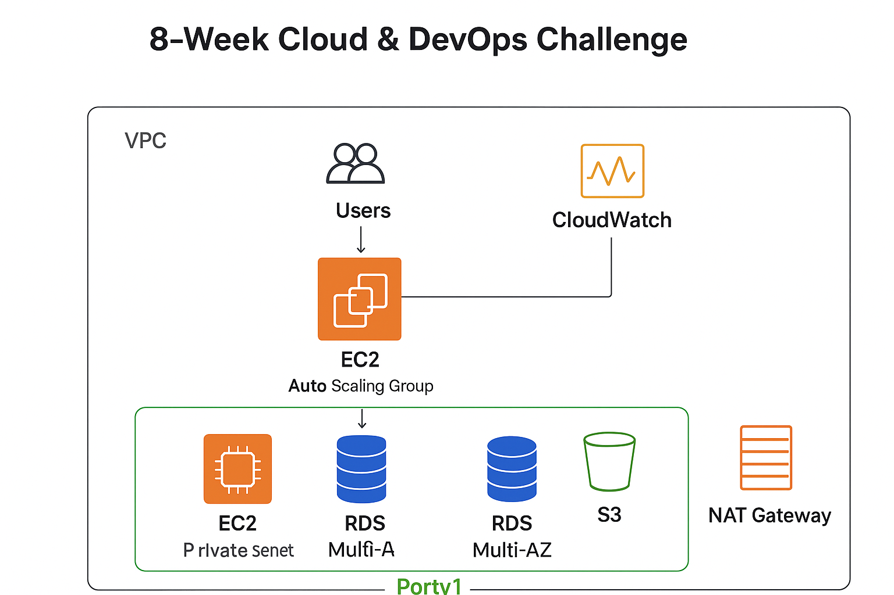

# 8-Week DevOps & Cloud Challenge – Terraform + AWS

## Overview

This repository documents my 8-week hands-on DevOps and Cloud/Platform Engineering challenge, focused on building resilient, scalable, and modular AWS infrastructure using Terraform and AWS.

The goal of this project is to demonstrate practical infrastructure engineering skills across Infrastructure as Code, AWS networking, compute, load balancing, monitoring, security, disaster readiness, and cloud operations.

By the end of this challenge, the project includes:

- A multi-tier, modular AWS infrastructure
- Reusable Terraform modules
- Hybrid compute modules supporting EC2 and Auto Scaling Groups
- Application Load Balancer (ALB) deployment
- CloudWatch monitoring and alarms
- Security best practices covering IAM, security groups, encryption, and least privilege
- Environment-based configuration for dev, stage, and prod
- Portfolio-ready documentation with Terraform modules, outputs, and architecture visuals

---

## Architecture Diagram



> Note: The image path currently uses `Daigram.png` to match the existing file name in the repository.

---

## Project Structure

```text
Week1/Week2/.../Week8/
│
├── main.tf                    # Root Terraform configuration
├── variables.tf               # Root variables
├── outputs.tf                 # Root outputs
├── modules/                   # Reusable Terraform modules
│   ├── vpc/
│   ├── compute-hybrid/
│   ├── alb/
│   ├── bastion_host/
│   ├── cloudwatch-alerts/
│   └── security/
├── envs/                      # Environment-specific tfvars
│   ├── dev/
│   ├── stage/
│   └── prod/
├── scripts/                   # User data or setup scripts
└── README.md
```

---

## Weekly Goals

### Week 1 – Cloud Foundations & Environment Setup

- Install Terraform and AWS CLI
- Configure AWS credentials
- Set up the Terraform folder structure
- Prepare basic state management
- Deploy a simple VPC with public and private subnets

### Week 2 – Networking & Security

- Build a Multi-AZ VPC
- Configure public and private subnets
- Configure Internet Gateway and NAT Gateways
- Apply Security Groups and IAM best practices
- Modularize networking components

### Week 3 – Compute & Bastion Host

- Launch EC2 instances
- Configure user data scripts
- Set up a Bastion host for secure SSH access
- Use Terraform outputs for inter-module communication
- Improve operational access and troubleshooting workflow

### Week 4 – Application Load Balancer & Basic Monitoring

- Deploy an Application Load Balancer
- Attach EC2 instances to the ALB target group
- Configure health checks
- Add basic CloudWatch alarms
- Expand Terraform modules for ALB and monitoring

### Week 5 – Hybrid Compute & Disaster Readiness

- Implement a compute-hybrid module with EC2 and Auto Scaling Group modes
- Use Launch Templates for Auto Scaling Groups
- Add the ability to switch between EC2 and ASG deployment modes
- Perform basic disaster-readiness testing
- Validate scaling policies using CloudWatch alarms

### Week 6 – Advanced Monitoring & Observability

- Integrate CloudWatch Logs
- Create CloudWatch dashboards
- Monitor CPU, memory, network, and ALB metrics
- Improve visibility into infrastructure health
- Explore optional Grafana dashboard integration

### Week 7 – Security & IAM

- Apply least-privilege IAM roles
- Harden access using Network ACLs and Security Groups
- Review encryption and secure configuration practices
- Configure Terraform state locking
- Review secrets management practices

### Week 8 – Final Project & Portfolio Integration

- Combine all modules into a production-style infrastructure stack
- Document architecture, modules, variables, and outputs
- Review security, monitoring, and reliability design
- Push final version to GitHub with visuals and documentation
- Prepare resume-ready engineering bullets from the project

---

## Optional Extensions

The core project focuses on AWS infrastructure using Terraform. The following extensions can be added to expand the portfolio value:

- Kubernetes using EKS, k3s, or kind
- CI/CD pipelines using GitHub Actions or AWS CodePipeline
- AI/ML deployment using AWS SageMaker, Lambda, and API Gateway
- Centralized logging and monitoring with Grafana or OpenSearch
- Cost optimization and tagging strategy
- Multi-environment promotion workflow across dev, stage, and prod

---

## How to Use

### 1. Clone the repository

```bash
git clone <repo-url>
cd 8-Week-DevOps-Platform-engineer-Challenge
```

### 2. Navigate to the target week

```bash
cd Week1
```

### 3. Initialize Terraform

```bash
terraform init
```

### 4. Review the execution plan

```bash
terraform plan -var-file=envs/dev/dev.tfvars
```

### 5. Apply the infrastructure

```bash
terraform apply -var-file=envs/dev/dev.tfvars --auto-approve
```

### 6. Switch between EC2 and ASG mode

From Week 5 onwards, the compute module supports switching between EC2 and Auto Scaling Group mode:

```hcl
compute_mode = "ec2" # or "asg"
```

### 7. Destroy resources after testing

```bash
terraform destroy -var-file=envs/dev/dev.tfvars --auto-approve
```

---

## Key Learnings

- Modular Terraform design for reusable infrastructure
- Multi-tier AWS networking with public and private subnets
- Hybrid compute strategies for small-scale and scalable deployments
- Application Load Balancer deployment and integration
- CloudWatch monitoring, alarms, and dashboard setup
- Disaster readiness and auto-healing with Auto Scaling Groups
- Security and IAM best practices
- Environment-based infrastructure configuration
- Infrastructure documentation for portfolio and GitHub showcase
- Translating infrastructure operations experience into cloud engineering practice

---

## Portfolio Value

This project is part of my transition from enterprise Infrastructure Operations into Cloud Infrastructure, DevOps, and Platform Engineering.

It reflects practical, hands-on work across infrastructure design, automation, monitoring, security, and cloud operations — the same areas required to operate stable and production-ready cloud environments.

This repository is intended to show not only Terraform syntax, but also infrastructure thinking:

- How components are structured
- How environments are separated
- How compute can evolve from EC2 to Auto Scaling Groups
- How monitoring and alarms support operational visibility
- How security and IAM should be considered from the beginning
- How documentation supports maintainability and handover

---

## Resume-Ready Highlights

- Built modular AWS infrastructure using Terraform, including VPC, compute, ALB, monitoring, and security modules.
- Designed hybrid compute deployment patterns supporting both EC2 and Auto Scaling Groups.
- Implemented CloudWatch monitoring and alarms to improve operational visibility.
- Applied security best practices across IAM, security groups, encryption, and access control.
- Structured infrastructure for multiple environments using dev, stage, and prod configuration files.
- Documented architecture, modules, usage steps, and operational considerations for portfolio presentation.

---

## Contact / Community

- LinkedIn: https://www.linkedin.com/in/ahmedshihab2023/
- Website: https://awsbenshehab.net

Questions, feedback, or collaboration ideas are welcome.

---

## License

<p align="center">
  
  
</p>

<p align="center">
  © 2025 <strong>Ahmed Bin Shehab</strong> — All Rights Reserved.<br>
  This repository is shared for portfolio and learning purposes.<br>
  Reuse, redistribution, or commercial use requires written permission.<br>
  📧 For collaboration or usage inquiries: <a href="mailto:a.shihab@hotmail.com">a.shihab@hotmail.com</a>
</p>